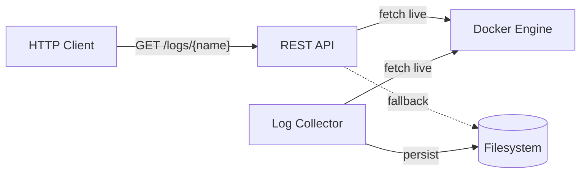

# Docker Log Proxy

> A lightweight REST API for persistent Docker container log storage and retrieval

[](https://goreportcard.com/report/github.com/matthieugusmini/docker-logproxy)

Docker Log Proxy monitors running Docker containers, captures their logs to the filesystem, and exposes them via a simple REST API. Logs remain accessible even after containers exit, making it ideal for debugging, auditing, and log aggregation workflows.

## Features

- **Automatic Discovery** - Monitors all running containers or specific containers by name
- **Persistent Storage** - Logs saved to filesystem and accessible after container termination
- **Real-time Streaming** - Stream logs as they're generated with `follow` parameter
- **Selective Output** - Filter stdout/stderr independently
- **Zero Configuration** - Works out of the box with sensible defaults
- **Extensible Design** - Modular architecture for pluggable storage backends

## Architecture



## Project Structure

```
docker-logproxy/
├── main.go                          # Application entry point
├── internal/
│   ├── api/                         # HTTP server and handlers
│   ├── docker/                      # Docker Engine API client wrapper
│   ├── dockerlogproxy/              # Core business logic
│   │   ├── log_collector.go         # Monitors containers and saves logs
│   │   ├── log_service.go           # Retrieves logs from Docker or storage
│   │   ├── container.go             # Container model
│   │   └── errors.go                # Application error types
│   └── filesystem/                  # Filesystem-based log storage
├── api/                             # OpenAPI specifications
└── Makefile                         # Build and test commands
```

## Quick Start

```bash
# Build and run the proxy
make build && ./docker-logproxy

# In another terminal, start a container
docker run --name test-container alpine echo "Hello World"

# Retrieve the logs via REST API
curl http://localhost:8000/logs/test-container
```

## Prerequisites

- **Go** 1.24.5 or higher
- **Docker Engine** running locally or accessible via TCP
- **Docker Socket Access** - typically requires `/var/run/docker.sock` permissions

## Installation

### From Source

```bash
# Clone the repository
git clone https://github.com/matthieugusmini/docker-logproxy.git
cd docker-logproxy

# Build the binary
make build

# Run the application
./docker-logproxy
```

### Using Go Install

```bash
go install github.com/matthieugusmini/docker-logproxy@latest
```

## Usage

### Starting the Server

Start the log proxy with default settings:

```bash
./docker-logproxy
```

The server will:
1. Connect to the Docker daemon
2. Discover all running containers
3. Start capturing logs to `./logs` directory
4. Expose the REST API on `http://localhost:8000`

### Command-line Flags

| Flag | Description | Default |
|------|-------------|---------|
| `-port` | HTTP server port | `8000` |
| `-log-dir` | Directory where container logs are stored | `logs` |
| `-containers` | Comma-separated list of container names to watch | All containers |
| `-v` | Enable debug logging | `false` |

**Examples:**

```bash
# Watch specific containers only
./docker-logproxy -containers nginx,redis

# Use custom port
./docker-logproxy -port 3000

# Store logs in custom directory
./docker-logproxy -log-dir /var/log/containers

# Enable verbose logging
./docker-logproxy -v
```

### API Endpoints

> [!TIP]
> Full API documentation is available in the OpenAPI specification at [`/api/openapi.yaml`](api/openapi.yaml). You can visualize and interact with the API using [Swagger Editor](https://editor.swagger.io/).

#### `GET /logs/{name}`

Retrieve logs for a specific container.

**Path Parameters:**
- `name` (required) - Container name or ID

**Query Parameters:**
- `follow` - Stream logs in real-time (`0` or `1`, default: `0`)
- `stdout` - Include stdout logs (`0` or `1`, default: `0`)
- `stderr` - Include stderr logs (`0` or `1`, default: `1`)

**Response:**
- `200 OK` - Returns logs as `text/plain`
- `404 Not Found` - Container not found
- `500 Internal Server Error` - Server error

## Examples

### Get stderr logs (default behavior)

```bash
curl http://localhost:8000/logs/nginx
```

### Stream logs in real-time

```bash
curl http://localhost:8000/logs/nginx?follow=1
```

### Get both stdout and stderr logs

```bash
curl http://localhost:8000/logs/nginx?stdout=1
```

### Get only stdout logs

```bash
curl http://localhost:8000/logs/nginx?stdout=1&stderr=0
```

### Stream only stderr logs

```bash
curl http://localhost:8000/logs/nginx?follow=1&stdout=0
```

## Testing

### Unit Tests

To test the business logic in isolation using test doubles.

```bash
make test-unit
```

### End-to-End Tests

Test the complete application with real Docker containers.

```bash
make test-e2e
```

## Why No Dockerfile?

This application monitors Docker containers on the host system and must run directly on the host. Running Docker inside a container (Docker-in-Docker) creates a separate daemon that can't see host containers.

> [!CAUTION]
> While mounting the Docker socket with `-v /var/run/docker.sock:/var/run/docker.sock` makes containerization technically possible, it grants root-equivalent host access.<sup>[1](#ref1)</sup> If you're comfortable with that risk, running the binary directly on the host is simpler and has a clearer security model.

<a name="ref1">1</a>: [Socket mounting implications](https://stackoverflow.com/questions/27879713/is-it-ok-to-run-docker-from-inside-docker)

---

**Note:** This project was created as a technical assessment demonstrating Go REST API development.
